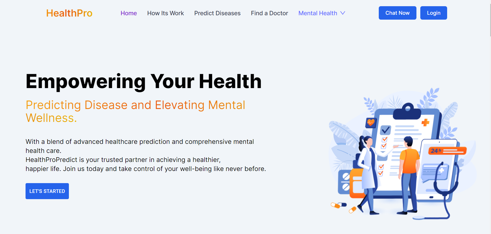
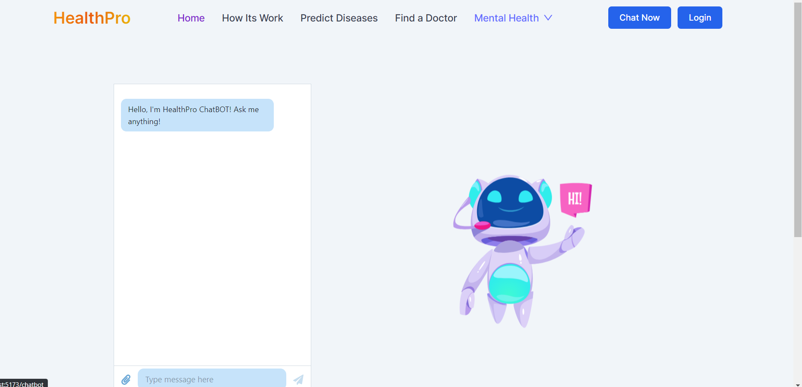

# HealthPro
Early Detection: Machine learning models can analyze large datasets to identify subtle patterns and indicators of diseases. This enables early detection of diseases before noticeable symptoms appear, increasing the chances of successful treatment.

Improved Healthcare Planning: By predicting disease outbreaks or identifying at-risk populations, healthcare providers and authorities can plan resources and interventions more effectively, ensuring that healthcare services are available where and when they are needed most.

Mental Health Support:, It can help identify individuals at risk of mental health issues and provide early intervention and support, reducing the burden on mental healthcare services.

# Screenshots

